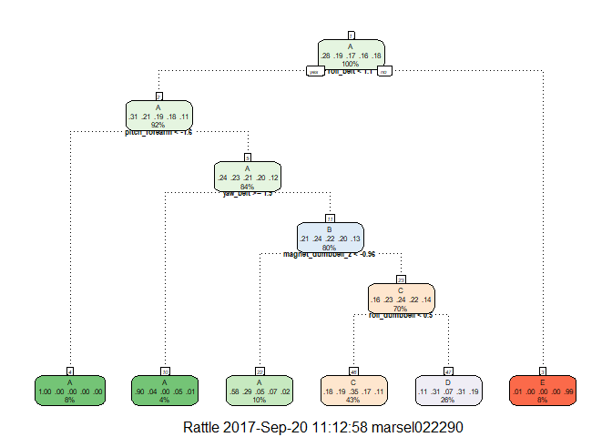
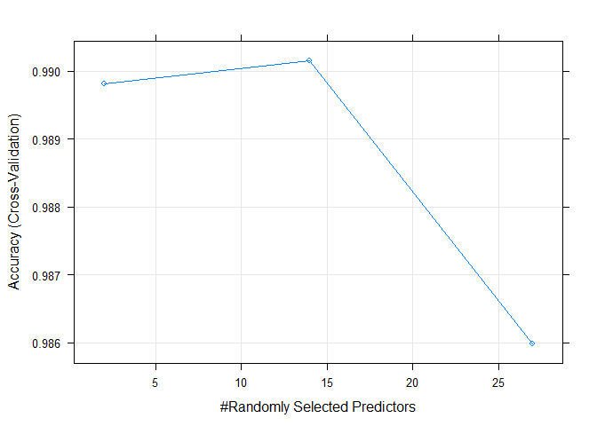

# Practical Machine Learning Course Project
Marsela Yulita  
20 September 2017  


## Introduction
Using devices such as Jawbone Up, Nike FuelBand, and Fitbit it is now possible to collect a large amount of data about personal activity relatively inexpensively. These type of devices are part of the quantified self movement - a group of enthusiasts who take measurements about themselves regularly to improve their health, to find patterns in their behavior, or because they are tech geeks. One thing that people regularly do is quantify how much of a particular activity they do, but they rarely quantify how well they do it. In this project, the goal will be to use data from accelerometers on the belt, forearm, arm, and dumbell of 6 participants. They were asked to perform barbell lifts correctly and incorrectly in 5 different ways. 

#### Load the data

```r
library(caret)
library(randomForest)
library(rattle)


#Download the data
if(!file.exists("pml-training.csv")){
  download.file("https://d396qusza40orc.cloudfront.net/predmachlearn/pml-training.csv", destfile = "pml-training.csv")}

if(!file.exists("pml-testing.csv")){
  download.file("https://d396qusza40orc.cloudfront.net/predmachlearn/pml-testing.csv", destfile = "pml-testing.csv")}

#Read the data
trainingData<- read.csv("pml-training.csv", sep=",", header=TRUE, na.strings = c("NA","",'#DIV/0!'))
testingData<- read.csv("pml-testing.csv", sep=",", header=TRUE, na.strings = c("NA","",'#DIV/0!'))

dim(trainingData)
```

```
## [1] 19622   160
```

```r
dim(testingData)
```

```
## [1]  20 160
```

#### Preprocessing data
Remove the missing values and zero variance variable.


```r
#Remove fields with NA
trainingData <- trainingData[,(colSums(is.na(trainingData)) == 0)]
testingData <- testingData[,(colSums(is.na(testingData)) == 0)]

dim(trainingData)
```

```
## [1] 19622    60
```

```r
dim(testingData)
```

```
## [1] 20 60
```

```r
#Preprocess step
numericalcol <- which(lapply(trainingData, class) %in% "numeric")

preprocessModel <-preProcess(trainingData[,numericalcol],method=c('knnImpute', 'center', 'scale'))
pre_trainingData <- predict(preprocessModel, trainingData[,numericalcol])
pre_trainingData$classe <- trainingData$classe

pre_testingData <-predict(preprocessModel,testingData[,numericalcol])

#Remove NearZeroVariance variables
nzv <- nearZeroVar(pre_trainingData,saveMetrics=TRUE)
pre_trainingData <- pre_trainingData[,nzv$nzv==FALSE]

nzv <- nearZeroVar(pre_testingData,saveMetrics=TRUE)
pre_testingData <- pre_testingData[,nzv$nzv==FALSE]
```

#### Cross validation
I will create partition in data set to make a training data set and test data set.


```r
#create data partition
set.seed(2017)
dtTrain<- createDataPartition(pre_trainingData$classe, p=0.6, list=FALSE)
training<- pre_trainingData[dtTrain, ]
validation <- pre_trainingData[-dtTrain, ]
dim(training) ; dim(validation)
```

```
## [1] 11776    28
```

```
## [1] 7846   28
```

#### Train Data
##### Decision Tree (rpart)
Then, I will used decision tree to build a predictive model.


```r
#train model with rpart
rpartmodel <- train(classe~., method="rpart", data=training)
rpartmodel$finalModel
```

```
## n= 11776 
## 
## node), split, n, loss, yval, (yprob)
##       * denotes terminal node
## 
##  1) root 11776 8428 A (0.28 0.19 0.17 0.16 0.18)  
##    2) roll_belt< 1.053267 10802 7463 A (0.31 0.21 0.19 0.18 0.11)  
##      4) pitch_forearm< -1.604375 952    3 A (1 0.0032 0 0 0) *
##      5) pitch_forearm>=-1.604375 9850 7460 A (0.24 0.23 0.21 0.2 0.12)  
##       10) yaw_belt>=1.898284 469   47 A (0.9 0.038 0 0.051 0.011) *
##       11) yaw_belt< 1.898284 9381 7123 B (0.21 0.24 0.22 0.2 0.13)  
##         22) magnet_dumbbell_z< -0.9613467 1181  494 A (0.58 0.29 0.047 0.065 0.02) *
##         23) magnet_dumbbell_z>=-0.9613467 8200 6201 C (0.16 0.23 0.24 0.22 0.14)  
##           46) roll_dumbbell< 0.5035994 5098 3330 C (0.18 0.19 0.35 0.17 0.11) *
##           47) roll_dumbbell>=0.5035994 3102 2133 D (0.11 0.31 0.074 0.31 0.19) *
##    3) roll_belt>=1.053267 974    9 E (0.0092 0 0 0 0.99) *
```

```r
fancyRpartPlot(rpartmodel$finalModel,cex=.5,under.cex=1,shadow.offset=0)
```

<!-- -->

```r
#predict with validation data
rpartpredict <- predict(rpartmodel,validation)
rpartmatrix <- confusionMatrix(validation$classe,rpartpredict)
rpartmatrix
```

```
## Confusion Matrix and Statistics
## 
##           Reference
## Prediction    A    B    C    D    E
##          A 1369    0  618  240    5
##          B  256    0  641  621    0
##          C   43    0 1147  178    0
##          D   86    0  574  626    0
##          E   25    0  414  337  666
## 
## Overall Statistics
##                                           
##                Accuracy : 0.4853          
##                  95% CI : (0.4742, 0.4965)
##     No Information Rate : 0.4326          
##     P-Value [Acc > NIR] : < 2.2e-16       
##                                           
##                   Kappa : 0.3587          
##  Mcnemar's Test P-Value : NA              
## 
## Statistics by Class:
## 
##                      Class: A Class: B Class: C Class: D Class: E
## Sensitivity            0.7695       NA   0.3379  0.31269  0.99255
## Specificity            0.8578   0.8065   0.9504  0.88706  0.89185
## Pos Pred Value         0.6134       NA   0.8385  0.48678  0.46186
## Neg Pred Value         0.9270       NA   0.6531  0.79024  0.99922
## Prevalence             0.2267   0.0000   0.4326  0.25516  0.08552
## Detection Rate         0.1745   0.0000   0.1462  0.07979  0.08488
## Detection Prevalence   0.2845   0.1935   0.1744  0.16391  0.18379
## Balanced Accuracy      0.8136       NA   0.6442  0.59988  0.94220
```

Unfortunately, we got the accuracy only 48.5%.

##### Random forest
Let's try the random-forest technique to generate a predictive model.


```r
#train model with random forest
modelFit <- train(classe ~., method="rf", data=training, trControl=trainControl(method='cv'), number=5, allowParallel=TRUE, importance=TRUE )
modelFit
```

```
## Random Forest 
## 
## 11776 samples
##    27 predictor
##     5 classes: 'A', 'B', 'C', 'D', 'E' 
## 
## No pre-processing
## Resampling: Cross-Validated (10 fold) 
## Summary of sample sizes: 10598, 10599, 10598, 10599, 10599, 10599, ... 
## Resampling results across tuning parameters:
## 
##   mtry  Accuracy   Kappa    
##    2    0.9898096  0.9871078
##   14    0.9901493  0.9875389
##   27    0.9859884  0.9822770
## 
## Accuracy was used to select the optimal model using  the largest value.
## The final value used for the model was mtry = 14.
```

```r
plot(modelFit)
```

<!-- -->

```r
#predict with validation data
predictvalid <- predict(modelFit, validation)
validmatrix <- confusionMatrix(validation$classe, predictvalid)
validmatrix
```

```
## Confusion Matrix and Statistics
## 
##           Reference
## Prediction    A    B    C    D    E
##          A 2226    4    1    0    1
##          B    8 1498   10    2    0
##          C    0    9 1341   14    4
##          D    0    1    9 1275    1
##          E    2    1    1    5 1433
## 
## Overall Statistics
##                                           
##                Accuracy : 0.9907          
##                  95% CI : (0.9883, 0.9927)
##     No Information Rate : 0.285           
##     P-Value [Acc > NIR] : < 2.2e-16       
##                                           
##                   Kappa : 0.9882          
##  Mcnemar's Test P-Value : NA              
## 
## Statistics by Class:
## 
##                      Class: A Class: B Class: C Class: D Class: E
## Sensitivity            0.9955   0.9901   0.9846   0.9838   0.9958
## Specificity            0.9989   0.9968   0.9958   0.9983   0.9986
## Pos Pred Value         0.9973   0.9868   0.9803   0.9914   0.9938
## Neg Pred Value         0.9982   0.9976   0.9968   0.9968   0.9991
## Prevalence             0.2850   0.1928   0.1736   0.1652   0.1834
## Detection Rate         0.2837   0.1909   0.1709   0.1625   0.1826
## Detection Prevalence   0.2845   0.1935   0.1744   0.1639   0.1838
## Balanced Accuracy      0.9972   0.9935   0.9902   0.9911   0.9972
```
We got 99.7% accuracy for random forest training model. So this model was a better model than decision tree.

#### Evaluate the model (in and out of sample error)

```r
#In training set
insample <- predict(modelFit,training)
confusionMatrix(training$classe,insample)
```

```
## Confusion Matrix and Statistics
## 
##           Reference
## Prediction    A    B    C    D    E
##          A 3348    0    0    0    0
##          B    0 2279    0    0    0
##          C    0    0 2054    0    0
##          D    0    0    0 1930    0
##          E    0    0    0    0 2165
## 
## Overall Statistics
##                                      
##                Accuracy : 1          
##                  95% CI : (0.9997, 1)
##     No Information Rate : 0.2843     
##     P-Value [Acc > NIR] : < 2.2e-16  
##                                      
##                   Kappa : 1          
##  Mcnemar's Test P-Value : NA         
## 
## Statistics by Class:
## 
##                      Class: A Class: B Class: C Class: D Class: E
## Sensitivity            1.0000   1.0000   1.0000   1.0000   1.0000
## Specificity            1.0000   1.0000   1.0000   1.0000   1.0000
## Pos Pred Value         1.0000   1.0000   1.0000   1.0000   1.0000
## Neg Pred Value         1.0000   1.0000   1.0000   1.0000   1.0000
## Prevalence             0.2843   0.1935   0.1744   0.1639   0.1838
## Detection Rate         0.2843   0.1935   0.1744   0.1639   0.1838
## Detection Prevalence   0.2843   0.1935   0.1744   0.1639   0.1838
## Balanced Accuracy      1.0000   1.0000   1.0000   1.0000   1.0000
```

```r
#out sample
confusionMatrix(validation$classe, predictvalid)
```

```
## Confusion Matrix and Statistics
## 
##           Reference
## Prediction    A    B    C    D    E
##          A 2226    4    1    0    1
##          B    8 1498   10    2    0
##          C    0    9 1341   14    4
##          D    0    1    9 1275    1
##          E    2    1    1    5 1433
## 
## Overall Statistics
##                                           
##                Accuracy : 0.9907          
##                  95% CI : (0.9883, 0.9927)
##     No Information Rate : 0.285           
##     P-Value [Acc > NIR] : < 2.2e-16       
##                                           
##                   Kappa : 0.9882          
##  Mcnemar's Test P-Value : NA              
## 
## Statistics by Class:
## 
##                      Class: A Class: B Class: C Class: D Class: E
## Sensitivity            0.9955   0.9901   0.9846   0.9838   0.9958
## Specificity            0.9989   0.9968   0.9958   0.9983   0.9986
## Pos Pred Value         0.9973   0.9868   0.9803   0.9914   0.9938
## Neg Pred Value         0.9982   0.9976   0.9968   0.9968   0.9991
## Prevalence             0.2850   0.1928   0.1736   0.1652   0.1834
## Detection Rate         0.2837   0.1909   0.1709   0.1625   0.1826
## Detection Prevalence   0.2845   0.1935   0.1744   0.1639   0.1838
## Balanced Accuracy      0.9972   0.9935   0.9902   0.9911   0.9972
```

The accuracy of the prediction is 99.07%. Hence, the in and out of sample error is 100% - 99.07% = 0.93%.

#### Using the model with the test data

```r
pred_final <- predict(modelFit, pre_testingData)
pred_final
```

```
##  [1] B A B A A E D B A A B C B A E E A B B B
## Levels: A B C D E
```

Here are the results, we will use them for the submission of this course project in the coursera platform.
